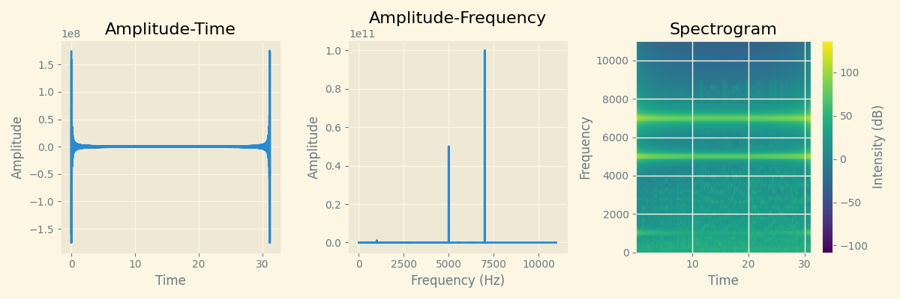

# **Audio Signal Processing and Analysis Using Python**
**[By Amirreza Yarahmadi](https://github.com/amirreza-yar/)**

## **Table of Contents**
1. [Introduction](#Introduction)
2. [Project Objectives](#Project-Objectives)
3. [Signal Processing Theory](#Signal-Processing-Theory)
   - [Fourier Transform](#Fourier-Transform)
   - [Signal Filtering](#Signal-Filtering)
4. [Implementation and Code Explanation](#Implementation-and-Code-Explanation)
   - [Noise Analysis and Filtering](#Noise-Analysis-and-Filtering)
   - [Speed Alteration](#Speed-Alteration)
   - [Audio Reversal](#Audio-Reversal)
5. [Code Implementation](#Code-Implementation)
    - [AudioAnalysis Class](#AudioAnalysis-Class)
    - [Initialization](#Initialization)
    - [Reading Audio Data](#Reading-Audio-Data)
    - [Changing Speed](#Changing-Speed)
    - [Reversing Audio](#Reversing-Audio)
    - [Applying Filters](#Applying-Filters)
    - [Low-pass Filter](#Low-pass-Filter)
    - [Band-stop Filter](#Band-stop-Filter)
    - [Multi-band Stop Filter](#Multi-band-Stop-Filter)
    - [Mixing Voices](#Mixing-Voices)
    - [Writing Audio Data](#Writing-Audio-Data)
    - [Saving Outputs](#Saving-Outputs)
    - [Plotting Amplitude vs Time](#Plotting-Amplitude-vs-Time)
    - [Plotting Amplitude vs Frequency](#Plotting-Amplitude-vs-Frequency)
    - [Plotting Spectrogram](#Plotting-Spectrogram)
7. [The Project](#The-Project)
   - [`analysis.py`](#File-analysis.py)
   - [`plotlib.py`](#File-plotlib.py)
   - [`main.py`](#File-main.py)
8. [Results and Analysis](#Results-and-Analysis)
9. [Conclusion](#Conclusion)

---

## Introduction

This project focuses on the processing and analysis of audio signals. The primary goals are to apply noise reduction filters, change the playback speed, and reverse audio signals. Additionally, the project involves visualizing these signals using time-domain and frequency-domain plots.

---

## Project Objectives

- Analyze and remove noise from audio signals
- Alter the playback speed of audio files
- Reverse audio signals
- Visualize audio signals in both time and frequency domains

---

## Signal Processing Theory

### Fourier Transform


The Fourier Transform is a mathematical transform that decomposes a function (often a time-domain signal) into its constituent frequencies. For audio signals, this means transforming the time-domain signal into the frequency domain, where the signal is represented by its amplitude and phase at various frequencies.

Mathematically, the Fourier Transform of a continuous time signal \( x(t) \) is given by:

$$
X(f) = \int_{-\infty}^{\infty} x(t) e^{-j2\pi ft} \, dt
$$

For discrete signals, the Discrete Fourier Transform (DFT) is used:

$$
X[k] = \sum_{n=0}^{N-1} x[n] e^{-j2\pi kn/N}
$$


### Signal Filtering

Filtering is a process used to remove or attenuate unwanted components from a signal. In audio processing, this often involves removing noise or certain frequency bands. Common types of filters include:

- **Low-Pass Filter:** Allows frequencies below a certain cutoff frequency to pass through and attenuates frequencies above the cutoff.
- **High-Pass Filter:** Allows frequencies above a certain cutoff frequency to pass through and attenuates frequencies below the cutoff.
- **Band-Stop Filter:** Attenuates frequencies within a certain range (band) and allows frequencies outside this range to pass through.

---


## The Project
#### File: `analysis.py`

This file contains the core functions and classes for audio analysis and processing, including reading audio files, applying filters, changing speed, and reversing audio.

#### File: `plotlib.py`

This file includes functions for visualizing audio signals using matplotlib. It contains functions to plot amplitude-time, amplitude-frequency, and spectrograms of audio signals.

#### File: `main.py`

This file demonstrates the usage of the functions and classes defined in `analysis.py` and `plotlib.py`. It processes an input audio file, applies noise reduction
z, speed alteration, and reversal, and saves the outputs.

---


---

## Implementation and Code Explanation

### Noise Analysis and Filtering

To remove noise from an audio signal, we apply band-stop filters at specific frequencies where the noise is present. This involves:

1. Identifying the noise frequencies
2. Designing a band-stop filter for each noise frequency
3. Applying the filters to the audio signal

### Speed Alteration

Changing the speed of an audio signal involves resampling the signal at a different rate. Increasing the speed requires selecting fewer samples from the original signal, while decreasing the speed requires adding more samples.

### Audio Reversal

Reversing an audio signal is straightforward: the time-domain samples of the signal are reversed. This can be achieved by simply reversing the array containing the audio samples.

## Code Implementation

In this section, we delve into the implementation details of the audio analysis and processing functionalities provided by the `AudioAnalysis` class and related functions.

### **AudioAnalysis Class**

The `AudioAnalysis` class provides various methods for manipulating and analyzing audio data, such as changing speed, reversing the audio, and applying filters.

#### Initialization

The constructor initializes the AudioAnalysis instance either by loading audio data from a file or using provided audio data. It computes the sample rate, audio data, amplitude, and frequency of the audio.

```python
class AudioAnalysis:
    """
    AudioAnalysis class for processing audio signals.
    
    Attributes:
        rate (int): Sampling rate of the audio.
        data (np.ndarray): Audio data.
        amplitude (np.ndarray): Amplitude spectrum of the audio.
        frequency (np.ndarray): Frequency spectrum of the audio.
    """

    def __init__(self, path=None, audio_data=None) -> None:
        self.rate, self.data, self.amplitude, self.frequency = self.read_voice(path=path, audio_data=audio_data)
```

#### Reading Audio Data

The `read_voice` method reads audio data either from a file path or from provided audio data. It returns the sample rate, audio data, amplitude (frequency domain representation), and corresponding frequencies.

```python
def read_voice(self, path, audio_data):
        """
        Read an audio file or initialize from existing audio data.
        
        Args:
            path (str): Path to the audio file.
            audio_data (dict): Dictionary containing rate, data, amplitude, and frequency.
        
        Returns:
            tuple: rate, data, amplitude, frequency
        """
        if path:
            rate, data = wavfile.read(path)
            amplitude = rfft(data)
            frequency = rfftfreq(len(data), 1 / rate)
            return rate, data, amplitude, frequency
        if audio_data:
            return audio_data['rate'], audio_data['data'], audio_data['amplitude'], audio_data['frequency']
```

#### Changing Speed

The change_speed method alters the playback speed of the audio by resampling the audio data. It adjusts the indices of the audio data based on the given speed factor and then recalculates the amplitude, frequency, and sample rate.

```python
def change_speed(self, speed_factor):
        """
        Change the speed of the audio.
        
        Args:
            speed_factor (float): Factor by which to change the speed.
        
        Returns:
            tuple: changed_data, new_amplitude, new_frequency, new_rate
        """
        indices = np.round(np.arange(0, len(self.data), speed_factor)).astype(int)
        indices = indices[indices < len(self.data)]
        changed_data = self.data[indices]

        new_amplitude = np.abs(rfft(changed_data))
        new_frequency = rfftfreq(len(changed_data), 1 / self.rate)
        new_rate = int(self.rate / speed_factor)
        return changed_data, new_amplitude, new_frequency, new_rate
```

#### Reversing Audio

The `reverse_voice` method reverses the audio signal. It reverses the array of audio data and recalculates the amplitude in the frequency domain.

```python
def reverse_voice(self):
        """
        Reverse the audio data.
        
        Returns:
            tuple: new_data, new_amplitude
        """
        new_data = self.data[::-1]
        new_amplitude = np.abs(rfft(new_data))
        return new_data, new_amplitude
```

#### Applying Filters

The `low_pass_filter` and `band_stop_filter` methods apply frequency domain filters to the audio signal. The `low_pass_filter` attenuates frequencies above a specified cutoff, while the `band_stop_filter` attenuates frequencies within a specified band range.

```python
def low_pass_filter(self, cutoff_freq):
        """
        Apply a low-pass filter to the audio data.
        
        Args:
            cutoff_freq (float): Cutoff frequency for the low-pass filter.
        
        Returns:
            np.ndarray: Filtered amplitude
        """
        filtered_amplitude = np.where(self.frequency > cutoff_freq, 0, self.amplitude)
        return filtered_amplitude
```

#### Multi-band Stop Filter

The `multi_band_stop_filter` method applies multiple band-stop filters to the audio signal. It attenuates multiple frequency bands, each specified by a center frequency and a bandwidth.

```python
def multi_band_stop_filter(self, band_freqs: list, band_widths: list):
        """
        Apply multiple band-stop filters to the audio data.
        
        Args:
            band_freqs (list): List of central frequencies for the stop bands.
            band_widths (list): List of widths for the stop bands.
        
        Returns:
            tuple: filtered_amplitude, filtered_data
        """
        filtered_amplitude = self.amplitude.copy()
        for band_freq, band_width in zip(band_freqs, band_widths):
            low_cutoff = band_freq - band_width / 2
            high_cutoff = band_freq + band_width / 2
            band_mask = (self.frequency >= low_cutoff) & (self.frequency <= high_cutoff)
            filtered_amplitude[band_mask] = 0
        filtered_data = np.fft.irfft(filtered_amplitude)
        return filtered_amplitude, filtered_data
```

#### Mixing and Writing Audio

The `mix_voices` function combines multiple audio signals into one by averaging their data. The `write_voice` function writes audio data to a file.

```python
def mix_voices(data_list, rate_list):
    """
    Mix multiple audio signals together.
    
    Args:
        data_list (list): List of audio data arrays.
        rate_list (list): List of sampling rates for the audio data.
    
    Returns:
        tuple: rate, mixed_data
    """
    min_length = min(len(data) for data in data_list)
    mixed_data = np.zeros(min_length)

    for data in data_list:
        mixed_data += data[:min_length]

    mixed_data /= len(data_list)
    return rate_list[0], mixed_data
```

#### Saving Outputs

The save_outputs function saves the processed audio data to files and generates plots for visualization.

```python
def save_outputs(amplitude, data, frequency, rate, file_dir_name):
    """
    Save audio data and generate plots for amplitude and spectrogram.
    
    Args:
        amplitude (np.ndarray): Amplitude spectrum.
        data (np.ndarray): Audio data.
        frequency (np.ndarray): Frequency spectrum.
        rate (int): Sampling rate.
        file_dir_name (str): Directory name to save the files.
    """
    write_voice(data, rate, f"{file_dir_name}.wav")
    plot_amplitude_time(data, rate, file_name=f"{file_dir_name}_data.png")
    plot_spectrogram(data, rate, file_name=f"{file_dir_name}_spectogram.png")
    plot_amplitude_frequency(amplitude, frequency, file_name=f"{file_dir_name}_amplitude.png")
```

### Plotting Audio Data

The `plotlib.py` module contains functions for plotting various aspects of audio data, including amplitude-frequency plots, spectrograms, and amplitude-time plots.

#### Setting Up the Plotting Style

The module begins by importing the necessary libraries and setting a dark theme for the plots.

```python
import matplotlib.pyplot as plt
import numpy as np

# Set a dark theme for plots
plt.style.use('dark_background')
```

#### Plotting Amplitude-Frequency

The `plot_amplitude_frequency` function plots the amplitude versus frequency.

```python
def plot_amplitude_frequency(amplitude: list, frequency: int, show=False, file_name=None, title="Amplitude-Frequency"):
    """
    Plots the amplitude versus frequency.

    Parameters:
    - amplitude (list): Amplitude data.
    - frequency (int): Frequency data.
    - show (bool): Whether to display the plot.
    - file_name (str): Filename to save the plot.
    - title (str): Title of the plot.
    """
    plt.figure(figsize=(10, 4))
    plt.plot(frequency, amplitude)
    plt.xlabel('Frequency (Hz)')
    plt.ylabel('Amplitude')
    plt.title(title)
    plt.grid(True)
    if show:
        plt.show()
    if file_name:
        plt.savefig(file_name, dpi=300, bbox_inches='tight')
```

**Explanation:**
- **Parameters:**
  - `amplitude` (list): The amplitude data to plot.
  - `frequency` (int): The corresponding frequency data.
  - `show` (bool): If `True`, the plot is displayed.
  - `file_name` (str): If provided, the plot is saved to this file.
  - `title` (str): The title of the plot.
- **Functionality:** This function creates a plot of amplitude versus frequency and optionally shows or saves it.

#### Plotting Spectrogram

The `plot_spectrogram` function plots the spectrogram of the audio data.

```python
def plot_spectrogram(data: list, rate: int, show=False, file_name=None, title="Spectrogram"):
    """
    Plots the spectrogram of the audio data.

    Parameters:
    - data (list): Audio data.
    - rate (int): Sampling rate.
    - show (bool): Whether to display the plot.
    - file_name (str): Filename to save the plot.
    - title (str): Title of the plot.
    """
    plt.figure(figsize=(10, 4))
    Pxx, freqs, bins, im = plt.specgram(data, Fs=rate)
    plt.xlabel('Time')
    plt.ylabel('Frequency')
    plt.title(title)
    plt.grid(True)
    cbar = plt.colorbar(im)
    cbar.set_label('Intensity (dB)')
    if show:
        plt.show()
    if file_name:
        plt.savefig(file_name, dpi=300, bbox_inches='tight')
```

**Explanation:**
- **Parameters:**
  - `data` (list): The audio data to plot.
  - `rate` (int): The sampling rate of the audio data.
  - `show` (bool): If `True`, the plot is displayed.
  - `file_name` (str): If provided, the plot is saved to this file.
  - `title` (str): The title of the plot.
- **Functionality:** This function creates a spectrogram plot of the audio data and optionally shows or saves it.

#### Plotting Amplitude-Time

The `plot_amplitude_time` function plots the amplitude versus time.

```python
def plot_amplitude_time(data, rate, show=False, file_name=None, title="Amplitude-Time"):
    """
    Plots the amplitude versus time.

    Parameters:
    - data (list): Audio data.
    - rate (int): Sampling rate.
    - show (bool): Whether to display the plot.
    - file_name (str): Filename to save the plot.
    - title (str): Title of the plot.
    """
    plt.figure(figsize=(10, 4))
    time = np.arange(0, len(data)) / rate
    plt.plot(time, data)
    plt.xlabel('Time')
    plt.ylabel('Amplitude')
    plt.title(title)
    if show:
        plt.show()
    if file_name:
        plt.savefig(file_name, dpi=300, bbox_inches='tight')
```

**Explanation:**
- **Parameters:**
  - `data` (list): The audio data to plot.
  - `rate` (int): The sampling rate of the audio data.
  - `show` (bool): If `True`, the plot is displayed.
  - `file_name` (str): If provided, the plot is saved to this file.
  - `title` (str): The title of the plot.
- **Functionality:** This function creates a plot of amplitude versus time and optionally shows or saves it.

#### Plotting Spectrogram and Amplitude-Frequency Side by Side

The `subplot_sepc_amp` function plots the spectrogram and amplitude-frequency plots side by side.

```python
def subplot_sepc_amp(data: list, rate: int, amplitude: list, frequency: int, show=False, file_name=None, title="Spectrogram and Amp-Freq"):
    """
    Plots the spectrogram and amplitude-frequency plots side by side.

    Parameters:
    - data (list): Audio data.
    - rate (int): Sampling rate.
    - amplitude (list): Amplitude data.
    - frequency (int): Frequency data.
    - show (bool): Whether to display the plot.
    - file_name (str): Filename to save the plot.
    - title (str): Title of the plot.
    """
    fig, axs = plt.subplots(1, 2, figsize=(12, 6))
    plt.subplot(1, 2, 1)
    plot_amplitude_frequency(amplitude, frequency, title="Amplitude-Frequency")
    plt.subplot(1, 2, 2)
    plot_spectrogram(data, rate, title="Spectrogram")
    if show:
        plt.show()
    if file_name:
        plt.savefig(file_name, dpi=300, bbox_inches='tight')
```

**Explanation:**
- **Parameters:**
  - `data` (list): The audio data to plot.
  - `rate` (int): The sampling rate of the audio data.
  - `amplitude` (list): The amplitude data to plot.
  - `frequency` (int): The corresponding frequency data.
  - `show` (bool): If `True`, the plot is displayed.
  - `file_name` (str): If provided, the plot is saved to this file.
  - `title` (str): The title of the plot.
- **Functionality:** This function creates side-by-side plots of the spectrogram and amplitude-frequency data and optionally shows or saves them.
```

The `plotlib.py` module contains functions for plotting various aspects of audio data, including amplitude-frequency plots, spectrograms, and amplitude-time plots.

#### Setting Up the Plotting Style

The module begins by importing the necessary libraries and setting a dark theme for the plots.

```python
import matplotlib.pyplot as plt
import numpy as np

# Set a dark theme for plots
plt.style.use('dark_background')
```

#### Plotting Amplitude-Frequency

The `plot_amplitude_frequency` function plots the amplitude versus frequency.

```python
def plot_amplitude_frequency(amplitude: list, frequency: int, show=False, file_name=None, title="Amplitude-Frequency"):
    """
    Plots the amplitude versus frequency.

    Parameters:
    - amplitude (list): Amplitude data.
    - frequency (int): Frequency data.
    - show (bool): Whether to display the plot.
    - file_name (str): Filename to save the plot.
    - title (str): Title of the plot.
    """
    plt.figure(figsize=(10, 4))
    plt.plot(frequency, amplitude)
    plt.xlabel('Frequency (Hz)')
    plt.ylabel('Amplitude')
    plt.title(title)
    plt.grid(True)
    if show:
        plt.show()
    if file_name:
        plt.savefig(file_name, dpi=300, bbox_inches='tight')
```

**Explanation:**
- **Parameters:**
  - `amplitude` (list): The amplitude data to plot.
  - `frequency` (int): The corresponding frequency data.
  - `show` (bool): If `True`, the plot is displayed.
  - `file_name` (str): If provided, the plot is saved to this file.
  - `title` (str): The title of the plot.
- **Functionality:** This function creates a plot of amplitude versus frequency and optionally shows or saves it.

#### Plotting Spectrogram

The `plot_spectrogram` function plots the spectrogram of the audio data.

```python
def plot_spectrogram(data: list, rate: int, show=False, file_name=None, title="Spectrogram"):
    """
    Plots the spectrogram of the audio data.

    Parameters:
    - data (list): Audio data.
    - rate (int): Sampling rate.
    - show (bool): Whether to display the plot.
    - file_name (str): Filename to save the plot.
    - title (str): Title of the plot.
    """
    plt.figure(figsize=(10, 4))
    Pxx, freqs, bins, im = plt.specgram(data, Fs=rate)
    plt.xlabel('Time')
    plt.ylabel('Frequency')
    plt.title(title)
    plt.grid(True)
    cbar = plt.colorbar(im)
    cbar.set_label('Intensity (dB)')
    if show:
        plt.show()
    if file_name:
        plt.savefig(file_name, dpi=300, bbox_inches='tight')
```

**Explanation:**
- **Parameters:**
  - `data` (list): The audio data to plot.
  - `rate` (int): The sampling rate of the audio data.
  - `show` (bool): If `True`, the plot is displayed.
  - `file_name` (str): If provided, the plot is saved to this file.
  - `title` (str): The title of the plot.
- **Functionality:** This function creates a spectrogram plot of the audio data and optionally shows or saves it.

#### Plotting Amplitude-Time

The `plot_amplitude_time` function plots the amplitude versus time.

```python
def plot_amplitude_time(data, rate, show=False, file_name=None, title="Amplitude-Time"):
    """
    Plots the amplitude versus time.

    Parameters:
    - data (list): Audio data.
    - rate (int): Sampling rate.
    - show (bool): Whether to display the plot.
    - file_name (str): Filename to save the plot.
    - title (str): Title of the plot.
    """
    plt.figure(figsize=(10, 4))
    time = np.arange(0, len(data)) / rate
    plt.plot(time, data)
    plt.xlabel('Time')
    plt.ylabel('Amplitude')
    plt.title(title)
    if show:
        plt.show()
    if file_name:
        plt.savefig(file_name, dpi=300, bbox_inches='tight')
```

**Explanation:**
- **Parameters:**
  - `data` (list): The audio data to plot.
  - `rate` (int): The sampling rate of the audio data.
  - `show` (bool): If `True`, the plot is displayed.
  - `file_name` (str): If provided, the plot is saved to this file.
  - `title` (str): The title of the plot.
- **Functionality:** This function creates a plot of amplitude versus time and optionally shows or saves it.

#### Plotting Spectrogram and Amplitude-Frequency Side by Side

The `subplot_sepc_amp` function plots the spectrogram and amplitude-frequency plots side by side.

```python
def subplot_sepc_amp(data: list, rate: int, amplitude: list, frequency: int, show=False, file_name=None, title="Spectrogram and Amp-Freq"):
    """
    Plots the spectrogram and amplitude-frequency plots side by side.

    Parameters:
    - data (list): Audio data.
    - rate (int): Sampling rate.
    - amplitude (list): Amplitude data.
    - frequency (int): Frequency data.
    - show (bool): Whether to display the plot.
    - file_name (str): Filename to save the plot.
    - title (str): Title of the plot.
    """
    fig, axs = plt.subplots(1, 2, figsize=(12, 6))
    plt.subplot(1, 2, 1)
    plot_amplitude_frequency(amplitude, frequency, title="Amplitude-Frequency")
    plt.subplot(1, 2, 2)
    plot_spectrogram(data, rate, title="Spectrogram")
    if show:
        plt.show()
    if file_name:
        plt.savefig(file_name, dpi=300, bbox_inches='tight')
```

**Explanation:**
- **Parameters:**
  - `data` (list): The audio data to plot.
  - `rate` (int): The sampling rate of the audio data.
  - `amplitude` (list): The amplitude data to plot.
  - `frequency` (int): The corresponding frequency data.
  - `show` (bool): If `True`, the plot is displayed.
  - `file_name` (str): If provided, the plot is saved to this file.
  - `title` (str): The title of the plot.
- **Functionality:** This function creates side-by-side plots of the spectrogram and amplitude-frequency data and optionally shows or saves them.

## Results and Analysis

In this section, we present the results of various audio processing tasks performed using the functions in `main.py`. We include before-and-after plots of the audio signals in the time and frequency domains. We discuss the effectiveness of noise reduction filters, the impact of speed alteration on audio quality, and the correctness of the reversed audio.

### 1. Noise Reduction

Noise reduction is crucial for enhancing the clarity of audio signals. Here, we apply a low-pass filter to remove high-frequency noise and a band-stop filter to eliminate specific frequency bands.

#### Original Audio Signal

First, let's visualize the original audio signal in the time and frequency domains.

```python
# Load the original audio
from analysis import AudioAnalysis
from plotlib import plot_amplitude_time, plot_amplitude_frequency, plot_spectrogram

audio_analysis = AudioAnalysis(path='path_to_your_audio_file.wav')
```





As you can see around 1kHz, 5kHz and 7kHz the signal have a huge amplitude that causes noise on the audio. I remove the noises using a multi-band stop filter that brought in previous section.

#### Apply multi-band stop filter for noise cancellation

Next, we apply a Apply multi-band stop filter for noise cancellation. The function used for this part is discussed in previous section but let's take a look again. The `multi_band_stop_filter` method applies multiple band-stop filters to the audio signal. It attenuates multiple frequency bands, each specified by a center frequency and a bandwidth.

```python
def multi_band_stop_filter(self, band_freqs: list, band_widths: list):
        """
        Apply multiple band-stop filters to the audio data.
        
        Args:
            band_freqs (list): List of central frequencies for the stop bands.
            band_widths (list): List of widths for the stop bands.
        
        Returns:
            tuple: filtered_amplitude, filtered_data
        """
        filtered_amplitude = self.amplitude.copy()
        for band_freq, band_width in zip(band_freqs, band_widths):
            low_cutoff = band_freq - band_width / 2
            high_cutoff = band_freq + band_width / 2
            band_mask = (self.frequency >= low_cutoff) & (self.frequency <= high_cutoff)
            filtered_amplitude[band_mask] = 0
        filtered_data = np.fft.irfft(filtered_amplitude)
        return filtered_amplitude, filtered_data
```

Now let's implement this method on the noisy signal.

```python
# Apply multi-band stop filter for noise cancellation and save the output
noise_cancled_audio_amplitude, noise_cancled_audio_data = sample_audio.multi_band_stop_filter([1000, 5000, 7000], [14, 14, 14])
```


As you can see the audio is clean and clear.

### 2. Speed Alteration

Speed alteration changes the playback speed of the audio without altering its pitch.

#### Changing Speed

We can change the speed of the audio by a certain factor. We double and behalf the speed.

```python
# Change speed
speed_factor = 2  # Speed up by 100%
fast_audio_x2_data, fast_audio_x2_amp, fast_audio_x2_freq, fast_audio_x2_rate = clean_audio.change_speed(
    speed_factor)
```


```python
# Change speed
speed_factor = 0.5  # Speed down by 50%
fast_audio_x2_data, fast_audio_x2_amp, fast_audio_x2_freq, fast_audio_x2_rate = clean_audio.change_speed(
    speed_factor)
```


### 3. Audio Reversal

Reversing the audio signal can be useful for various audio processing tasks, such as creating sound effects.

#### Reversing Audio

We reverse the audio signal and plot the results.

```python
# Reverse audio
reversed_data, reversed_amplitude = audio_analysis.reverse_voice()
```


### Summary of Results

Discuss the results observed from the above plots:

- **Noise Reduction**: Evaluate the effectiveness of the low-pass and band-stop filters.
- **Speed Alteration**: Analyze how changing the speed affects the audio quality.
- **Audio Reversal**: Confirm that the audio reversal was performed correctly.
- **Combined Filters**: Assess the effectiveness of using multiple filters together.

By running the provided code snippets and analyzing the results, we can gain a deeper understanding of the audio processing techniques and their impact on the audio signals.

---

## Conclusion

In this project, we explored various techniques for audio signal processing and analysis using Python. We implemented a comprehensive set of tools that allow for the manipulation and visualization of audio signals, providing a robust framework for tasks such as noise reduction, speed alteration, audio reversal, and the creation of spectrograms.

### Key Takeaways

1. **Audio Processing Techniques**: 
    - **Noise Reduction**: By implementing multi-band stop filters, we were able to effectively reduce noise in audio signals, making them clearer and more suitable for further analysis.
    - **Speed Alteration**: The `change_speed` function showcased how resampling can change the playback speed of audio without affecting its pitch significantly.
    - **Audio Reversal**: Reversing audio signals provides a simple yet effective way to understand time-domain manipulations and their impacts on audio perception.

2. **Fourier Transform**:
    - The project heavily utilized Fourier Transform techniques (using `rfft` and `rfftfreq` from the `scipy.fft` module) to convert time-domain signals into the frequency domain. This conversion is crucial for applying frequency-based filters and understanding the spectral content of audio signals.

3. **Visualization**:
    - Visualization plays a key role in signal processing. By plotting amplitude-frequency graphs, amplitude-time graphs, and spectrograms, we gained valuable insights into the structure and content of audio signals. The `plotlib.py` module facilitated this visualization process, making it easier to interpret the results of various signal processing techniques.

4. **Integration and Modularity**:
    - The project demonstrates the power of modularity and integration. By separating concerns into different modules (`analysis.py` for processing and `plotlib.py` for plotting), we created a flexible and reusable codebase. This modularity allows for easy extension and adaptation of the code for different types of audio analysis tasks.

### Practical Applications

- **Noise Reduction in Audio**: The noise reduction techniques demonstrated can be applied to enhance audio recordings in various fields, such as music production, podcasting, and telecommunication.
- **Speed and Pitch Adjustment**: The ability to change the speed of audio playback without affecting pitch is useful in applications like music training, transcription services, and speech therapy.
- **Audio Data Analysis**: The visualization techniques and frequency domain analysis can be applied in research areas such as acoustics, linguistics, and audio forensics.

### Future Work

- **Enhanced Filtering Techniques**: Implementing more sophisticated filtering techniques, such as adaptive filtering, can further improve the quality of noise reduction.
- **Real-Time Processing**: Extending the framework to support real-time audio processing would open up new possibilities in live audio applications.
- **Machine Learning Integration**: Integrating machine learning models for tasks like speech recognition, audio classification, and enhancement can significantly expand the capabilities of the framework.

### Summary

This project provided a solid foundation in audio signal processing and analysis using Python. Through the implementation of the `AudioAnalysis` class and associated functions, we explored practical and theoretical aspects of audio processing. The ability to manipulate and visualize audio data not only aids in understanding audio signals better but also has a wide range of practical applications in various industries. 

By leveraging powerful Python libraries such as `numpy`, `scipy`, and `matplotlib`, we demonstrated how complex signal processing tasks can be efficiently performed. This project sets the stage for further exploration and development in the field of audio analysis, with many exciting possibilities for future work.

